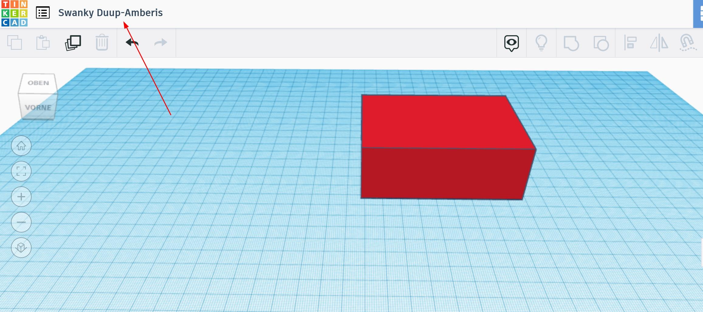
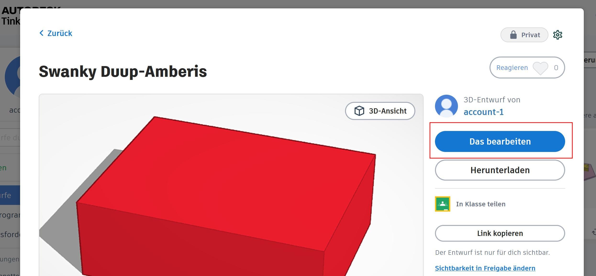
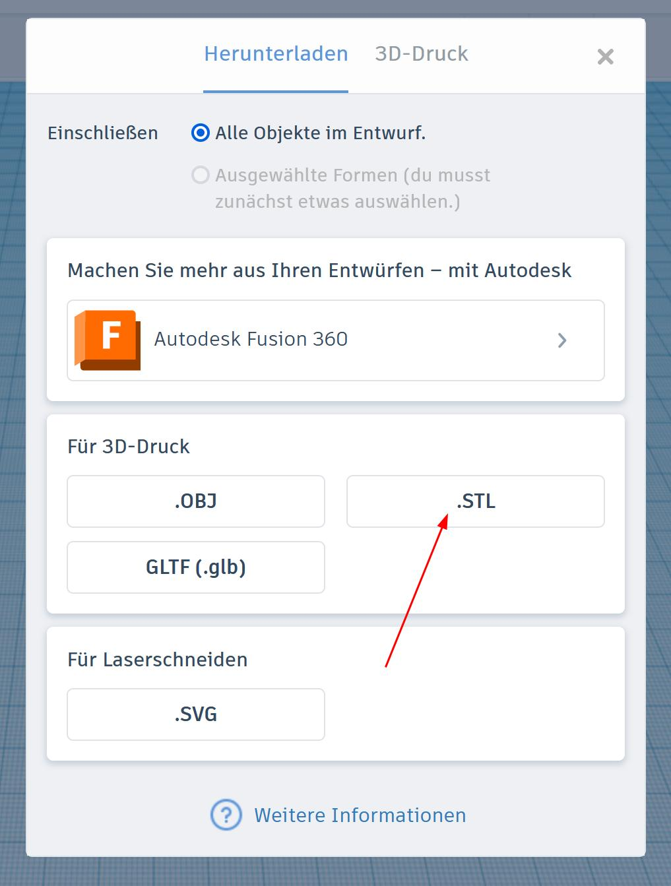

# 3D-Druck

Mit den 3D-Druckern im Digitallabor kannst du verschiedendste Figuren und Vorlagen drucken. Dazu benutzt du das Programm [Tinkercad](https://www.tinkercad.com/). Die Zugangsdaten dazu findest du im Makerspace an der Magnetwand.

## Neues Projekt erstellen

Du kannst ein neues Projekt erstellen, indem du links im Bereich "Entwürfe" auf "+ Erstellen" und dann "3D-Entwurf" klickst

Damit du deinen Entwurf beim nächsten mal wiederfindest, kannst du ihn mit einem Klick auf den Namen links oben umbenennen.

Um zum Menü zurückzukommen, kannst du oben auf das Tinkercad-Logo klicken. Dein Entwurf wird unter dem angegebenen Namen automatisch gespeichert.

## Vorhandenes Projekt laden

Du kannst an einem Projekt, das du zum Beispiel beim letzen Lab angefangen hast, weiterarbeiten, indem du im Entwürfe-Bereich auf dein Projekt klickst.

Daraufhin öffnet sich ein Popup mit der detailierten Projektbeschreibung. Klicke auf "Das bearbeiten", um das Projekt im 3D-Editor zu öffnen.

## Inspiration

Um dir Ideen für eigene Projekte zu holen, kannst du zum Beispiel auf der Webseite [Printables](https://www.printables.com/de) vorbeischauen. Dort kannst du dir kostenlos 3D-Modelle anderer Personen anschauen und sogar herunterladen & in dein Projekt einfügen.

## Drucken

Um dein Projekt zu drucken, musst du rechts oben auf "Exportieren" klicken.

Daraufhin öffnet sich ein Popup, in dem du auf den Button ".STL" klickst. 

Jetzt kann es ein bisschen dauern bis das Programm deine Anfrage verarbeitet hat. Es sollte sich aber bald ein Fenster öffnen, in dem du die Datei auf deinem PC speichern kannst.
Anschließend musst du diese Datei in dem Programm "PrusaSlicer" importieren.