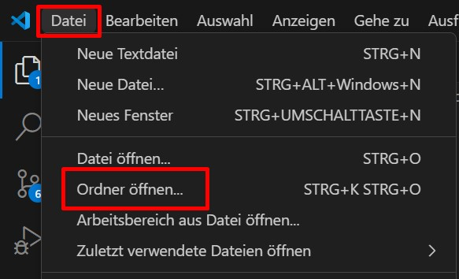

# Erste Schritte

## Das Terminal

Zuerst öffnest du in Visual Studio Code (VSCode) den Ordner, in dem du das Projekt abspeichern möchtest. Hier werden alle Projekt- und Codedateien später liegen.



Wähle am unteren Bildschirmrand den Reiter "Terminal" aus. Falls der Reiter nicht offen sein sollte, kannst du ihn oben über das Menü `Terminal` -> `Neues Terminal` öffnen.


Im Terminal kannst du direkt Befehle an den Computer geben, die im aktuellen Ordner ausgeführt werden (Im Screenshot oben ist das Terminal beispielsweise im Ordner `H:\Programming\Repositories\jugendhackt-ms-kb` geöffnet).

## Das erste Projekt

Um C# auszuführen, brauchst du zuerst ein sogenanntes 'Projekt'. Das kannst du erstellen, indem du im Terminal folgenden Befehl ausführst: 
```ps
dotnet new console --name FirstSteps --framework net8.0 --language "C#"
```

Dadurch erstellst du ein neues Projekt mit dem Namen 'FirstSteps' in der aktuellsten Version von C#.

Danach musst du noch `cd .\FirstSteps` im Terminal ausführen, um in den eben erstellten `FirstSteps` Ordner zu gehen (ansonsten kannst du später das Programm nicht starten). Der Befehl `cd` steht für "change directory", also "wechsel den Ordner".


Jetzt solltest du mehrere Dateien links im Explorer sehen


Die Datei `FirstSteps.csproj` ist für dich vorerst irrelevant. Sie wird später dazu benutzt, um andere Projekte zu verknüpfen.<br/>
`Program.cs` ist die wichtigere Datei. Die Dateiendung `.cs` gibt an, dass es sich um eine C#-Datei handelt und dadurch ausführbaren Code beinhaltet. Standardmäßig ist sie am Anfang mit einer Codezeile gefüllt, die bei Ausführung den Text `Hello, World!` in die Ausgabe schreibt:
```cs
Console.WriteLine("Hello, World!");
```

Um den Code in der Datei auszuführen, kannst du im Terminal den Befehl `dotnet run` ausführen


Jetzt bist du bereit, Code auszuführen und wir können uns auf Schreiben von Programmen konzentrieren!